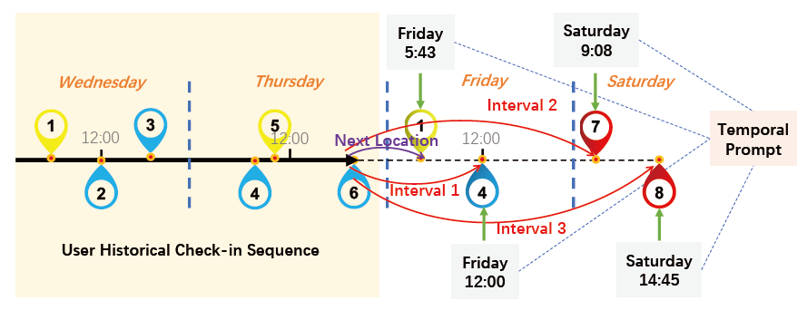
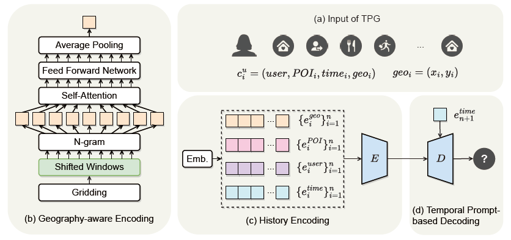
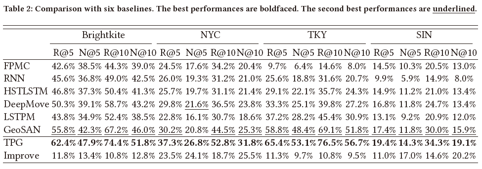
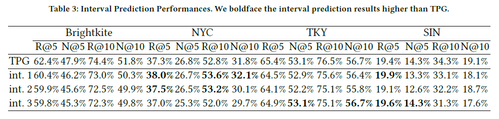

# TPG
**Time as Prompt for A Geography-aware Next Location Recommendation Framework** (*WWW*'2023 Under Review) only for demostration.

Yan Luo, **Haoyi Duan**, Ye Liu and CHUNG Fu-Lai

## Introduction

Our team revisited the problem of location recommendation and pointed out that temporal information of POI was indispensable in real-world applications, and that current methods did not make effective use of geographic information but suffered from the hard boundary problem when encoding geographic information by gridding. Therefore, we proposed a Temporal Prompt-based and Geography-aware (TPG) framework which has the unique ability of interval prediction. Our contributions are as follows:

- **Temporal prompt** is firstly designed to incorporate temporal information of next location. 
- **Shifted window** is then devised to augment geographic data for addressing the hard boundary problem. 

Via extensive comparisons with existing methods and ablation studies on four real-world datasets, we demonstrate the effectiveness and superiority of the proposed method under various settings. Most importantly, our proposed model has the unique ability of interval prediction, i.e., predicting the location that a user wants to go to at a certain time while the most recent check-in behavioral data is masked. The experimental results on four benchmark datasets demonstrated the superiority of TPG comparing with other state-of-the-art methods. The results indicated that temporal signal of next location is of great significance. We also demonstrate through ablation studies that our proposed shifted window mechanism is capable of overcoming defects of previous approaches.

Figure 1.

Figure 1. is an illustration of how **TPG** performs **next location recommendation** (denoted by purple line) and **interval prediction** (denoted by red lines) tasks. Different colors of markers denote different categories of POIs. Given the user historical check-in sequence is POI 1-6 from Wednesday to Thursday, the model can know the next four locations the user will go are POI 1 at 5:43 Friday, POI 4 at 12:00 Friday, POI 7 at 9:08 Saturday, and POI 8 at 14:45 Saturday. Predicting POI 1 at 5:43 Friday is the task of next location recommendation. By making use of temporal prompt, TPG can also predict the location that a user wants to go at a certain time (i.e., interval prediction). For example, the model can predict POI 4 at 12:00 Friday (interval 1), POI 7 at 9:08 Saturday (interval 2), and POI 8 at 14:45 Saturday (interval 3), only based on historical check-in sequence POI 1-6.

## Framework

Each check-in $c_{i}^u = (u, t_i, p_i)$ is a user, POI, time tuple, which denotes a behavior that a user $u$ visits POI $p_i$ at time $t_i$. Each POI $p_i$ has its own geographic coordinates $(x_i, y_i)$. Each user $u$ has a sequence of historical check-ins $C_{1 \rightarrow n}^u = \{c_{i}^u\}_{i=1}^n$. Given the historical check-in sequences of users, the goal of next location recommendation is to predict the next POI $\rho_{t_{n+1}}$ that a certain user $u$ will visit at a certain time $t_{n+1}$.

Figure 2.

The overall architecture of our TPG framework is described in Figure 2. Based on the transformer's encoder-decoder structure, TPG can be divided into three parts, i.e., **geography-aware encoder**, **history encoder**, and **temporal prompt-based decoder**. For each check-in, the geographic coordinate of POI can be fed into the geography-aware encoder to get geographical representation $e_i^{geo}$. The historical check-in sequences including POI, user, and time information are then fed into the multi-modal embedding module to generate hidden representations $\{e_i^{POI}\}_{i=1}^n$, $\{e_i^{user}\}_{i=1}^n$, and $\{e_i^{time}\}_{i=1}^n$. Together with $\{e_i^{geo}\}_{i=1}^n$ from the geography-aware encoder, these representations are processed by a history encoder to generate user travel preference representation. Using temporal information of $t_{n+1}$ as prompt, the temporal prompt query and user travel preference memory are then forwarded to the decoder, which is capable of generating more accurate predictions for the next locations.

## Experiments and Evaluations

We compare the performance of our proposed TPG with baselines. Tables 2 reports the performance of TPG and six baselines in terms of Recall@k and NDCG@k on four real world datasets. The “Improve” column refers to the improvement rate of TPG compared to the second best model.

By introducing temporal prompt, our model has a capability that no other POI recommendation model has. TPG is able to predict next location even when some most recent check-in behavior is masked. In other words, TPG can make interval prediction. Relevant results are given in Table 3.We here mask one ("int. 1" in Table 3), two ("int. 2" in Table 3), and three ("int. 3" in Table 3) most recent check-in(s) of users to test TPG’s performance on interval prediction task on all datasets.

## Conclusion

In this paper, we revisit next location recommendation problem, finding that most methods ignore the prerequisite of knowing the exact time for the POI which needs to be predicted in real world applications. Therefore, we redefine next location recommendation, arguing that timestamp of next location is a necessary information. We propose TPG, a temporal prompt-based and geography-aware framework, for next location recommendation. We showed how to use time as prompt and how to avoid the hard boundary problem with regard to geographic coordinates of check-ins. The experimental results on four benchmark datasets demonstrated the superiority of TPG comparing with other state-of-the-art methods. The results indicated that temporal signal of next location is of great significance. We also demonstrate through ablation studies that our proposed shifted window mechanism is capable of overcoming defects of previous approaches. 

As for future work, we plan to transfer prompt into more intelligent one. Large-scale pre-trained models from NLP communities have demonstrated unlimited potential.We can consider to combine POI recommendation with language pre-trained models through prompt.